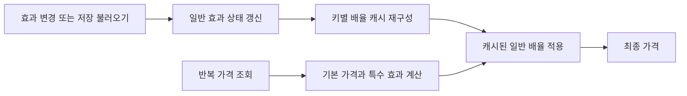

# 시세 계산과 파생 캐시

## Issue

거래 화면에서 여러 상품의 현재 가격을 반복해서 조회하는 동안, 동일한 가격 효과를 매번 다시 합산하면 효과가 바뀌지 않은 구간에도 계산이 반복됩니다. 반대로 최종 가격까지 별도로 저장하면 가격의 원인 상태와 계산 결과를 함께 갱신해야 하는 부담이 생깁니다.

## Solution

일반 효과의 누적 상태와 조회용 배율을 분리했습니다. 효과가 추가되거나 저장 상태를 불러올 때 `RebuildNormalModifiers`로 키별 배율을 다시 만들고, 가격 조회에서는 만들어진 배율을 사용하도록 했습니다.

최종 가격은 기본 가격, 특수 효과, 일반 효과 순서로 계산합니다. 캐시는 이 중 일반 효과에 한정하고, 저장에는 다시 계산할 수 있는 파생 배율 대신 원인 상태를 남기도록 했습니다.

## Result

효과가 바뀌지 않은 구간에서는 일반 효과를 다시 합산하지 않고 캐시된 배율을 사용하도록 했습니다. 불러오기 후에도 저장된 원인 상태를 기준으로 캐시를 재구성하여, 저장된 원인과 별도로 저장한 캐시가 어긋나는 구조를 피했습니다.

대신 효과 변경 시 캐시 재구성 비용과 캐시 메모리가 필요합니다. 모든 가격 조회 과정이나 모든 종류의 효과가 상수 시간인 것은 아닙니다.

## 코드와 테스트

- [`GetCurrentPrice` 계산 흐름](../Source/Assets/Scripts/Data/RuntimeItemPriceManager.cs)
- [원인 상태, 캐시 재구성, 일반 효과 적용](../Source/Assets/Scripts/Data/NormalEffectManager.cs)
- [벤치마크 실행기](../Source/Assets/Editor/PriceLookupBenchmarks/PriceLookupBenchmarkRunner.cs)
- [벤치마크 결과 창](../Source/Assets/Editor/PriceLookupBenchmarks/PriceLookupPerformanceWindow.cs)

벤치마크는 합성 데이터의 조회 경로를 비교하는 도구입니다. 실제 게임의 `GetCurrentPrice` 전체를 직접 호출하는 측정이 아니며, 캐시 생성 비용도 조회 측정에서 제외됩니다. 따라서 조회 방식의 비용 차이를 확인하는 참고 자료로 사용하고, 게임 전체의 프레임 개선율로 표현하지 않습니다.

### 기존 실험 기록

상품 200종과 마을 5개의 조합인 1,000개 키, 효과 규칙 20개를 구성하고 조회 100,000회를 하나의 측정 단위로 비교했습니다. 워밍업 10회 후 100회 측정한 중앙값은 미캐시 경로 73.2298ms, 캐시 경로 44.9944ms로 약 38.6% 감소했습니다. 기록상 두 경로의 계산 결과 동등성 검사는 통과했습니다.

[2026-08-16 원시 측정 CSV](../Evidence/PriceLookupBenchmark-20260816-191207.csv)

이 수치는 위 합성 조회 실험의 결과이며 실제 게임 프레임, 캐시 재구성 비용 또는 현재 전체 프로젝트의 재측정 결과가 아닙니다.
